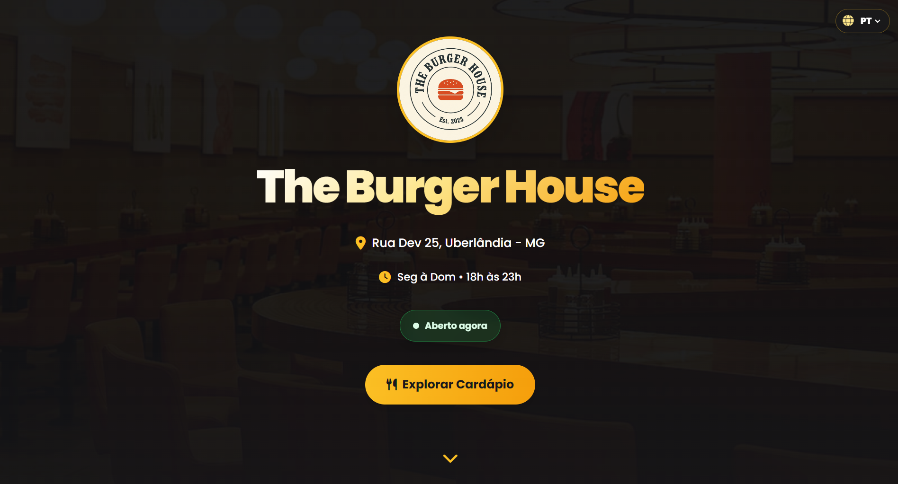
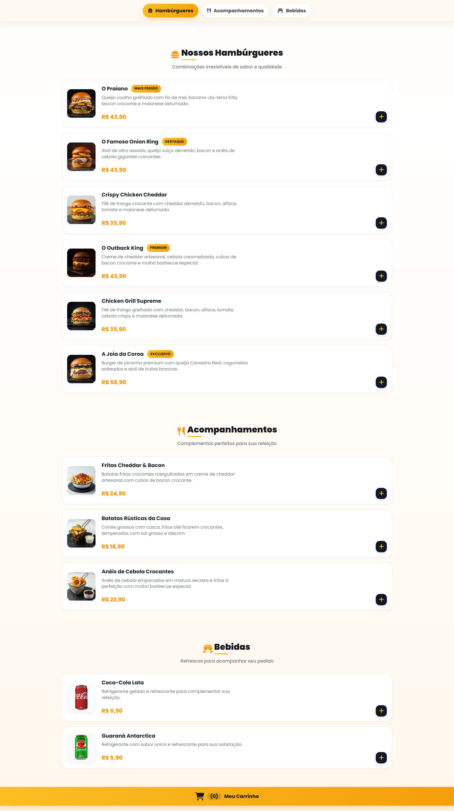
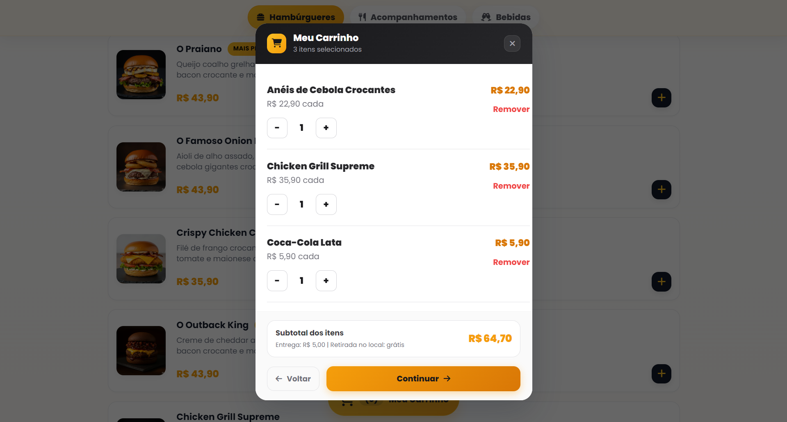
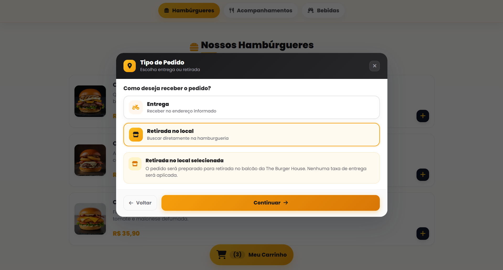
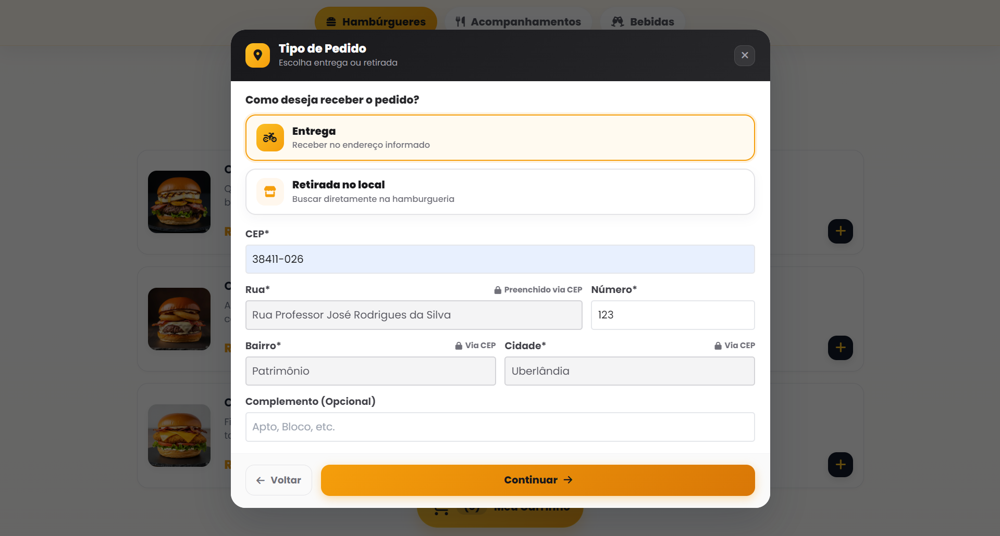
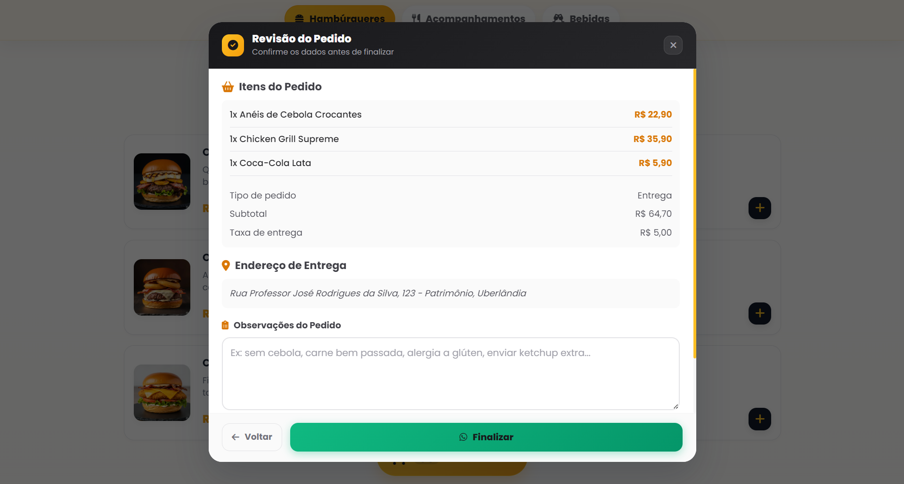

# 🍔 The Burger House

Aplicação web de **cardápio digital para hamburgueria**, desenvolvida com **HTML5, JavaScript Vanilla, Tailwind CSS e Vite**, com fluxo completo de pedido, integração com WhatsApp, internacionalização, acessibilidade, testes automatizados, performance, segurança e CI/CD.

🌐 [Deploy](https://burger-shop-aiib.vercel.app/) • 📂 [Repositório](https://github.com/felipe-frc/the-burger-house) • 🧪 [GitHub Actions](https://github.com/felipe-frc/the-burger-house/actions) • 📦 [Releases](https://github.com/felipe-frc/the-burger-house/releases)

[](https://github.com/felipe-frc/the-burger-house/actions) [](https://burger-shop-aiib.vercel.app/)       

---

## 📌 Sobre o projeto

O fluxo de pagamentos usa Mercado Pago Checkout Pro. Consulte [configuração, retorno, webhook e banco](docs/checkout-pro.md).

O **The Burger House** simula uma experiência real de compra em uma hamburgueria. O cliente pode navegar pelo cardápio, adicionar produtos ao carrinho, escolher entre **entrega ou retirada**, consultar endereço por CEP, revisar o pedido e finalizar o atendimento pelo WhatsApp.

Mais do que uma interface, o projeto foi estruturado para demonstrar competências de desenvolvimento front-end em um cenário próximo ao profissional: **arquitetura modular, regras de negócio isoladas, gerenciamento de estado, consumo de API, testes em múltiplas camadas, acessibilidade, performance, segurança e automação com CI/CD**.

### 🎯 O que este projeto demonstra

| Competência         | Aplicação no projeto                                                 |
| ------------------- | -------------------------------------------------------------------- |
| JavaScript          | ES Modules, DOM, eventos, estado e regras de negócio                 |
| Arquitetura         | Separação entre dados, UI, estado, serviços e regras de domínio      |
| Integração          | Consumo da API ViaCEP com tratamento de falhas                       |
| Persistência        | Carrinho e idioma armazenados no `localStorage`                      |
| Internacionalização | Interface e cardápio em Português e Inglês                           |
| Testes              | Vitest, jsdom, Playwright e axe-core                                 |
| Qualidade           | ESLint, Prettier, TypeScript `checkJs` e quality gates               |
| Acessibilidade      | Navegação por teclado, foco em modais, ARIA e auditoria automatizada |
| Performance         | Otimização de mídia e auditoria com Lighthouse                       |
| Segurança           | Auditoria de dependências com `npm audit`                            |
| CI/CD               | Pipeline GitHub Actions com Quality → Build → E2E                    |
| Deploy              | Publicação contínua na Vercel                                        |

---

## ⭐ Destaques técnicos

- **60/60 testes automatizados** com Vitest
- **22/22 execuções E2E** com Playwright: 11 desktop + 11 mobile
- Auditorias de acessibilidade com **axe-core**
- Cobertura protegida por **quality gates**
- Integração ViaCEP isolada em `scripts/services/viacep-service.js`
- Regras do carrinho isoladas em `cart-service.js`
- Estado compartilhado centralizado em `state.js`
- Internacionalização em **Português e Inglês**
- Logo principal otimizada de aproximadamente **1,56 MB para ~8 KB**
- Open Graph utilizando o asset otimizado
- Lighthouse Mobile: **95 Performance / 100 Accessibility / 100 Best Practices / 100 SEO**
- `robots.txt` válido
- **0 vulnerabilidades** no `npm audit`
- Auditoria de segurança integrada ao CI

---

## 🚀 Funcionalidades

| Área                  | Recursos                                                             |
| --------------------- | -------------------------------------------------------------------- |
| 🍔 Cardápio           | Produtos por categoria, imagens, descrições, preços, tags e tradução |
| 🛒 Carrinho           | Adição, remoção, quantidade, subtotal, taxa, total e persistência    |
| 🚚 Entrega / Retirada | Fluxos independentes com tratamento da taxa de entrega               |
| 📍 Endereço           | Consulta ViaCEP, preenchimento automático e validações               |
| 📦 Revisão            | Produtos, quantidades, valores, modalidade, endereço e observações   |
| 💬 WhatsApp           | Geração da mensagem final e limpeza do carrinho                      |
| 🌎 Idiomas            | Português/Inglês com persistência da preferência                     |
| 🕒 Loja               | Status Aberto/Fechado calculado dinamicamente                        |

### 🍔 Cardápio

- Exibição por categorias: Hambúrgueres, Acompanhamentos e Bebidas
- Renderização dinâmica via JavaScript
- Dados centralizados em módulo próprio
- Imagens, descrições, preços e tags
- Navegação rápida por categorias
- Animações de entrada durante o scroll
- Tradução dinâmica dos produtos

### 🛒 Carrinho

- Adicionar e remover produtos
- Incrementar e decrementar quantidade
- Remoção automática ao chegar a zero
- Cálculo de subtotal, taxa de entrega e total
- Persistência com `localStorage`
- Validação de carrinho vazio
- Feedback visual com toast
- Regras principais isoladas em `cart-service.js`

### 🚚 Entrega ou retirada

**Entrega**

- mantém a taxa de entrega
- direciona para o formulário de endereço
- exige dados válidos antes da revisão

**Retirada no local**

- dispensa o preenchimento do endereço
- remove automaticamente a taxa de entrega
- segue diretamente para a revisão

### 📍 Endereço de entrega

- Consulta automática por CEP
- Integração com a API ViaCEP
- Preenchimento automático de rua, bairro e cidade
- Validação do CEP e número do endereço
- Tratamento de CEP inexistente
- Tratamento de falhas de rede
- Mensagens de erro acessíveis
- Indicação visual dos campos preenchidos automaticamente

### 📦 Revisão e finalização

A revisão apresenta:

- produtos selecionados
- quantidade de cada item
- subtotal
- taxa de entrega
- total final
- tipo de pedido
- endereço, quando aplicável
- campo opcional de observações

Na finalização:

- o pedido é convertido em uma mensagem estruturada
- o WhatsApp é aberto para envio
- o carrinho é limpo
- os dados persistidos são atualizados
- a aplicação fica pronta para um novo pedido

### 🌎 Internacionalização

- Português e Inglês
- Seletor de idioma
- Persistência da preferência no `localStorage`
- Tradução dos principais textos
- Tradução do cardápio dinâmico
- Atualização imediata da interface ao trocar o idioma
- Cobertura automatizada da camada de i18n

---

## ♿ Acessibilidade

A acessibilidade faz parte da implementação e da estratégia de testes.

| Recurso               | Aplicação                               |
| --------------------- | --------------------------------------- |
| `aria-live`           | Comunicação de atualizações dinâmicas   |
| `aria-modal`          | Identificação dos modais                |
| `aria-describedby`    | Associação entre campos e mensagens     |
| `role="alert"`        | Mensagens importantes e erros           |
| Focus trap            | Mantém a navegação dentro do modal      |
| Teclado               | Navegação e fechamento com `Esc`        |
| Gerenciamento de foco | Foco automático e restauração ao fechar |
| Overlay               | Fechamento controlado dos modais        |
| Alt text              | Descrição das imagens                   |
| Contraste             | Revisão dos elementos críticos          |

### 🧪 Auditorias automatizadas

O projeto utiliza **axe-core integrado ao Playwright** para auditar automaticamente:

- página inicial
- carrinho
- formulário de endereço
- revisão do pedido

As verificações consideram regras relacionadas a:

- WCAG 2.0 A
- WCAG 2.0 AA
- WCAG 2.1 A
- WCAG 2.1 AA

---

## 🛠️ Tecnologias

| Categoria                   | Tecnologia                     |
| --------------------------- | ------------------------------ |
| Estrutura                   | HTML5                          |
| Linguagem                   | JavaScript ES6+                |
| Estilização                 | Tailwind CSS + CSS customizado |
| Build / Dev Server          | Vite                           |
| Persistência                | localStorage                   |
| API externa                 | ViaCEP                         |
| Notificações                | Toastify JS                    |
| Ícones                      | Font Awesome                   |
| Tipografia                  | Google Fonts                   |
| Testes                      | Vitest                         |
| Cobertura                   | Vitest Coverage V8             |
| E2E                         | Playwright                     |
| Acessibilidade automatizada | axe-core                       |
| Ambiente de testes          | jsdom                          |
| Lint                        | ESLint                         |
| Formatação                  | Prettier                       |
| Typecheck                   | TypeScript `checkJs`           |
| CI/CD                       | GitHub Actions                 |
| Deploy                      | Vercel                         |
| Versionamento               | Git / GitHub                   |

---

## 🏗️ Arquitetura

A estrutura separa responsabilidades para facilitar manutenção, testes e evolução do projeto.

| Módulo                               | Responsabilidade                    |
| ------------------------------------ | ----------------------------------- |
| `scripts/data.js`                    | Produtos e dados do cardápio        |
| `scripts/cart-service.js`            | Regras de negócio do carrinho       |
| `scripts/cart.js`                    | Interface e eventos do carrinho     |
| `scripts/state.js`                   | Estado compartilhado e persistência |
| `scripts/address.js`                 | Formulário e regras de endereço     |
| `scripts/services/viacep-service.js` | Comunicação com ViaCEP              |
| `scripts/order.js`                   | Revisão e finalização               |
| `scripts/i18n.js`                    | Internacionalização                 |
| `scripts/ui.js`                      | Interface, modais e navegação       |
| `scripts/config.js`                  | Configurações gerais                |
| `scripts/main.js`                    | Inicialização da aplicação          |
| `scripts/utils.js`                   | Funções utilitárias                 |

### 📁 Estrutura do repositório

```txt
the-burger-house/
│
├── .github/
│   └── workflows/
│       └── frontend-ci.yml
│
├── assets/
│   ├── optimized/
│   │   └── logo-burger.webp
│   └── ...
│
├── docs/
│   └── images/
│       ├── home.png
│       ├── cardapio.png
│       ├── cart.png
│       ├── pedido.png
│       ├── endereco.png
│       └── revisao.png
│
├── public/
│   └── robots.txt
│
├── scripts/
│   ├── services/
│   │   └── viacep-service.js
│   ├── address.js
│   ├── cart-service.js
│   ├── cart.js
│   ├── config.js
│   ├── data.js
│   ├── i18n.js
│   ├── main.js
│   ├── order.js
│   ├── state.js
│   ├── ui.js
│   └── utils.js
│
├── styles/
│   └── style.css
│
├── tests/
│   ├── e2e/
│   │   ├── accessibility.e2e.js
│   │   └── checkout.e2e.js
│   ├── address.test.js
│   ├── cart-service.test.js
│   ├── cart.test.js
│   ├── data.test.js
│   ├── i18n.test.js
│   ├── main.test.js
│   ├── order.test.js
│   ├── ui-extended.test.js
│   ├── ui.test.js
│   ├── utils.test.js
│   └── viacep-service.test.js
│
├── .gitignore
├── .prettierignore
├── .prettierrc.json
├── eslint.config.js
├── index.html
├── jsconfig.json
├── LICENSE
├── package.json
├── package-lock.json
├── playwright.config.js
├── README.md
├── tailwind.config.js
└── vercel.json
```

---

## 📸 Interface

### 🏠 Página inicial

Hero section, identidade visual da hamburgueria, informações de atendimento e status dinâmico da loja.



### 🍔 Cardápio

Produtos organizados por categorias, com imagem, descrição, preço, destaque e ação para adicionar ao carrinho.



### 🛒 Carrinho

Edição do pedido com quantidade, subtotal, taxa e total.



### 🚚 Tipo de pedido

Escolha entre **Entrega** ou **Retirada no local**.



### 📍 Endereço de entrega

Consulta automática do CEP, preenchimento assistido e validações.



### 📦 Revisão do pedido

Resumo final dos produtos, valores, modalidade, endereço e observações.



---

## ✅ Qualidade e testes

### 📊 Estado atual

| Métrica                  | Resultado |
| ------------------------ | --------: |
| Arquivos de teste Vitest |    **11** |
| Testes automatizados     | **60/60** |
| Testes com falha         |     **0** |
| E2E desktop              | **11/11** |
| E2E mobile               | **11/11** |
| Execuções E2E totais     | **22/22** |
| Vulnerabilidades npm     |     **0** |

### 📈 Cobertura e quality gates

| Métrica    | Cobertura atual | Quality Gate |
| ---------- | --------------: | -----------: |
| Statements |      **75.63%** |          75% |
| Branches   |      **58.81%** |          55% |
| Functions  |      **85.62%** |          80% |
| Lines      |      **78.89%** |          75% |

> Se a cobertura cair abaixo dos limites definidos, o CI falha automaticamente.

### 🧪 Vitest

A suíte cobre:

- `address.js`
- `viacep-service.js`
- `cart-service.js`
- `cart.js`
- `data.js`
- `i18n.js`
- `main.js`
- `order.js`
- `ui.js`
- `utils.js`

Entre os cenários validados estão:

- consistência dos dados do cardápio
- formatação de preços
- escape de HTML
- regras do carrinho
- quantidade de produtos
- subtotal, taxa e total
- estado da interface
- inicialização da aplicação
- internacionalização
- endereço
- ViaCEP
- revisão do pedido

### 🎭 Playwright

A suíte possui **11 cenários por projeto de navegador**:

- Chromium Desktop
- Chromium Mobile com perfil Pixel 5

Os E2E validam:

- compra completa com entrega
- retirada no local sem endereço
- CEP inválido
- bloqueio quando o carrinho fica vazio
- troca de idioma
- observações longas
- remoção de produto antes da revisão
- acessibilidade da página inicial, carrinho, endereço e revisão

---

## ⚡ Performance, SEO e segurança

O projeto foi auditado com **Google Lighthouse** em Chrome Incognito utilizando perfil Mobile.

### 📊 Lighthouse

| Categoria      | Pontuação |
| -------------- | --------: |
| Performance    |    **95** |
| Accessibility  |   **100** |
| Best Practices |   **100** |
| SEO            |   **100** |

### ⚙️ Métricas

| Métrica                  | Resultado |
| ------------------------ | --------: |
| First Contentful Paint   | **1.7 s** |
| Largest Contentful Paint | **2.7 s** |
| Total Blocking Time      | **10 ms** |
| Cumulative Layout Shift  | **0.008** |
| Speed Index              | **1.9 s** |

### 🖼️ Otimização de mídia

A logo principal passou de aproximadamente **1.56 MB para ~8 KB**.

```txt
Performance: 74 → 95
LCP:         10.6 s → 2.7 s
```

A versão otimizada também é utilizada no **Open Graph**.

### 🔎 SEO

- `meta description`
- Open Graph com asset otimizado
- `robots.txt` válido
- imagens com dimensões definidas
- textos alternativos
- estrutura semântica
- mídia principal otimizada

### 🔐 Segurança

```bash
npm audit
```

Estado atual:

```txt
found 0 vulnerabilities
```

A auditoria também faz parte do job **Quality** do GitHub Actions. Caso uma vulnerabilidade conhecida seja detectada, o pipeline pode falhar antes das etapas de Build e E2E.

As dependências vulneráveis identificadas durante o hardening foram atualizadas de forma controlada, **sem `--force`**.

---

## 🔁 CI/CD

O GitHub Actions executa um pipeline encadeado:

```txt
Quality
   ↓
Build
   ↓
E2E
```

### 🧪 Quality

```bash
npm ci
npm audit
npm run lint
npm run format:check
npm run typecheck
npm run test:coverage
```

Valida segurança, qualidade do JavaScript, formatação, tipos e cobertura. O relatório de cobertura também é publicado como artifact temporário.

### 🏗️ Build

```bash
npm ci
npm run build
```

Só é executado após o job **Quality** terminar com sucesso.

### 🎭 E2E

O workflow:

1. instala as dependências
2. instala o Chromium
3. gera o build de produção
4. sobe o servidor local do Vite
5. aguarda o servidor responder
6. executa os E2E
7. valida desktop e mobile

---

## ⚙️ Como executar

### Pré-requisitos

- Node.js 20 ou superior
- npm
- Git

### Instalação

```bash
git clone https://github.com/felipe-frc/the-burger-house.git
cd the-burger-house
npm ci
npm run dev
```

O ambiente local será disponibilizado em uma URL semelhante a:

```txt
http://localhost:5173
```

### Comandos disponíveis

| Objetivo                                  | Comando                                         |
| ----------------------------------------- | ----------------------------------------------- |
| Instalar dependências                     | `npm ci`                                        |
| Atualizar dependências em desenvolvimento | `npm install`                                   |
| Iniciar desenvolvimento                   | `npm run dev`                                   |
| Gerar build                               | `npm run build`                                 |
| Visualizar build                          | `npm run preview`                               |
| Executar lint                             | `npm run lint`                                  |
| Verificar formatação                      | `npm run format:check`                          |
| Executar typecheck                        | `npm run typecheck`                             |
| Rodar testes                              | `npm test`                                      |
| Rodar testes com cobertura                | `npm run test:coverage`                         |
| Rodar E2E desktop + mobile                | `npm run e2e`                                   |
| Rodar somente E2E mobile                  | `npx playwright test --project=mobile-chromium` |
| Auditar dependências                      | `npm audit`                                     |

O build final é gerado em:

```txt
dist/
```

---

## 🧠 Decisões de desenvolvimento

| Decisão                       | Motivo                                                      |
| ----------------------------- | ----------------------------------------------------------- |
| JavaScript Vanilla            | Aprofundar fundamentos da linguagem, DOM, eventos e módulos |
| Vite                          | Modernizar o ambiente de desenvolvimento e build            |
| ES Modules                    | Separar responsabilidades e reduzir arquivos monolíticos    |
| `cart-service.js`             | Isolar regras do carrinho da interface                      |
| `state.js`                    | Centralizar estado e persistência                           |
| Service ViaCEP                | Separar comunicação HTTP da lógica do formulário            |
| i18n                          | Concentrar textos e permitir troca dinâmica de idioma       |
| axe-core + Playwright         | Automatizar verificações de acessibilidade                  |
| Testes em camadas             | Proteger regras, DOM e fluxos completos                     |
| Quality gates                 | Impedir queda de cobertura abaixo dos limites               |
| ESLint + Prettier + Typecheck | Melhorar consistência e detecção antecipada de problemas    |
| GitHub Actions                | Automatizar qualidade, segurança, build e E2E               |
| Vercel                        | Automatizar o deploy de produção                            |

---

## 🧾 Releases

| Versão                                                                       | Categoria      | Destaque                                                                                      |
| ---------------------------------------------------------------------------- | -------------- | --------------------------------------------------------------------------------------------- |
| **v2.7.0**                                                                   | 🚀 Atual       | Hardening técnico, 60 testes, E2E desktop/mobile, acessibilidade, Lighthouse, SEO e segurança |
| [v2.6.0](https://github.com/felipe-frc/the-burger-house/releases/tag/v2.6.0) | 🧪 Testes      | Testes E2E com Playwright                                                                     |
| [v2.5.0](https://github.com/felipe-frc/the-burger-house/releases/tag/v2.5.0) | ♻️ Refatoração | Refatoração do carrinho e cobertura de testes                                                 |
| [v2.4.1](https://github.com/felipe-frc/the-burger-house/releases/tag/v2.4.1) | 🛠️ Manutenção  | Documentação, CI e otimização da logo                                                         |
| [v2.4.0](https://github.com/felipe-frc/the-burger-house/releases/tag/v2.4.0) | 🌎 Feature     | Internacionalização inicial                                                                   |
| [v2.3.0](https://github.com/felipe-frc/the-burger-house/releases/tag/v2.3.0) | 🧪 Testes      | Testes automatizados com Vitest                                                               |
| v2.2.2                                                                       | 🩹 Correção    | Correções de consistência estrutural                                                          |
| v2.2.1                                                                       | ⚡ Melhoria    | Melhorias de SEO e performance                                                                |
| v2.2.0                                                                       | ✨ Feature     | Retirada no local e melhorias no carrinho                                                     |
| v2.1.0                                                                       | ✨ Feature     | Campo de observações no pedido                                                                |
| v2.0.0                                                                       | 🚀 Major       | Melhorias de navegação e UX                                                                   |
| v1.3.0                                                                       | ♿ Melhoria    | Acessibilidade e experiência nos modais                                                       |
| v1.2.1                                                                       | 🩹 Correção    | Correções de CI e produção                                                                    |
| v1.2.0                                                                       | 🩹 Correção    | Correções no formulário de endereço                                                           |
| v1.1.0                                                                       | ♻️ Refatoração | Refatoração estrutural                                                                        |
| v1.0.0                                                                       | 🎉 Inicial     | Primeira versão estável                                                                       |

📦 [Consultar histórico completo de releases](https://github.com/felipe-frc/the-burger-house/releases)

---

## 🔮 Melhorias futuras

- 🔎 Busca de produtos
- 🧩 Filtros no cardápio
- 📝 Observações específicas por item
- 🚚 Cálculo de entrega por região ou faixa de CEP
- 🗄️ Backend para persistência de pedidos
- 🔐 Autenticação
- 🧑‍💼 Painel administrativo
- 💾 Banco de dados
- 🧾 Histórico de pedidos
- 📦 Acompanhamento do status do pedido

---

## ⚠️ Observações

- A consulta de endereço depende da disponibilidade da API ViaCEP
- É necessário acesso à internet para consulta real de CEP
- A finalização depende da abertura do WhatsApp
- O carrinho é persistido no `localStorage`
- A preferência de idioma também é persistida no navegador
- `coverage/` é gerado localmente e não deve ser versionado
- Relatórios do Playwright são temporários
- `output.css` é gerado pelo processo de desenvolvimento/build
- A fonte principal dos estilos permanece em `styles/style.css`

---

## 📄 Licença

Este projeto está sob a licença **MIT**. Consulte o arquivo [LICENSE](LICENSE).

---

## 👨🏻‍💻 Autor

**Marcos Felipe França**

[LinkedIn](https://www.linkedin.com/in/marcosfelipefrc) • [GitHub](https://github.com/felipe-frc)
