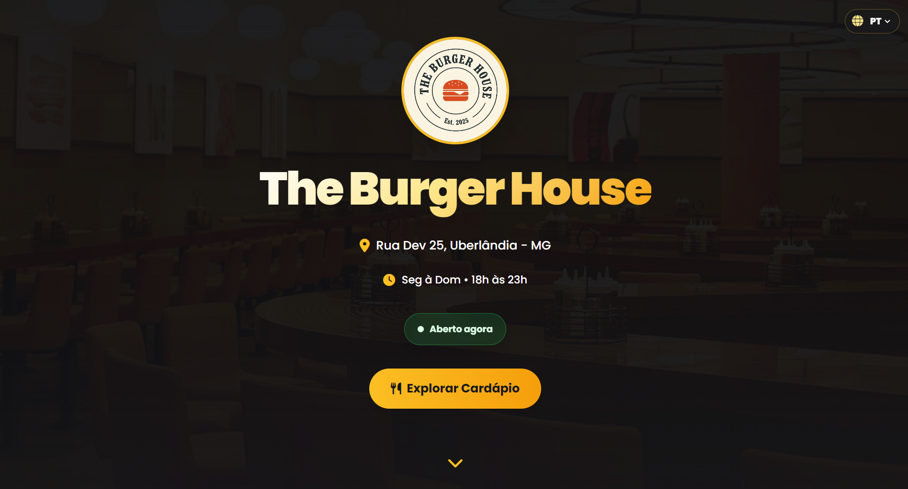
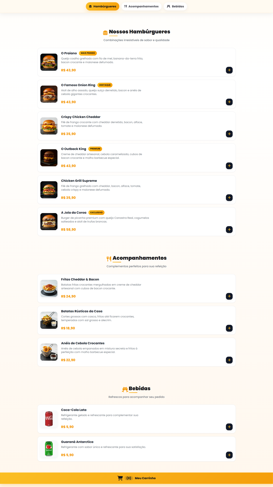
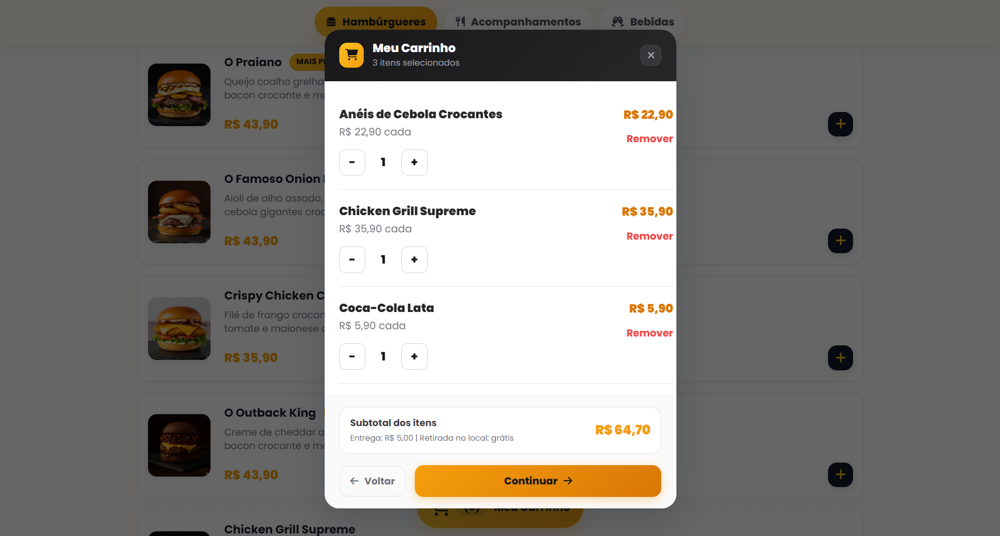
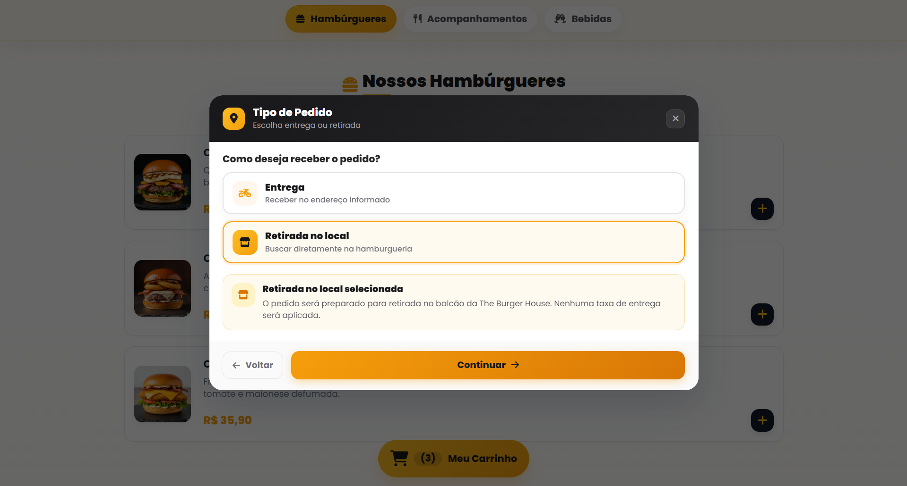
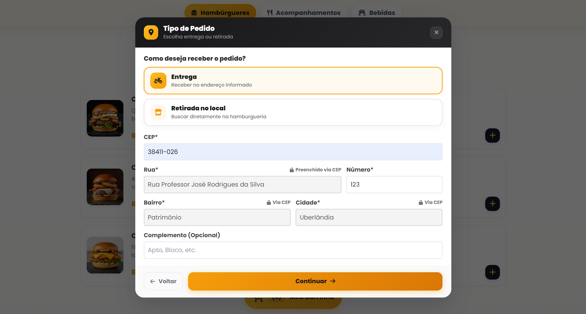
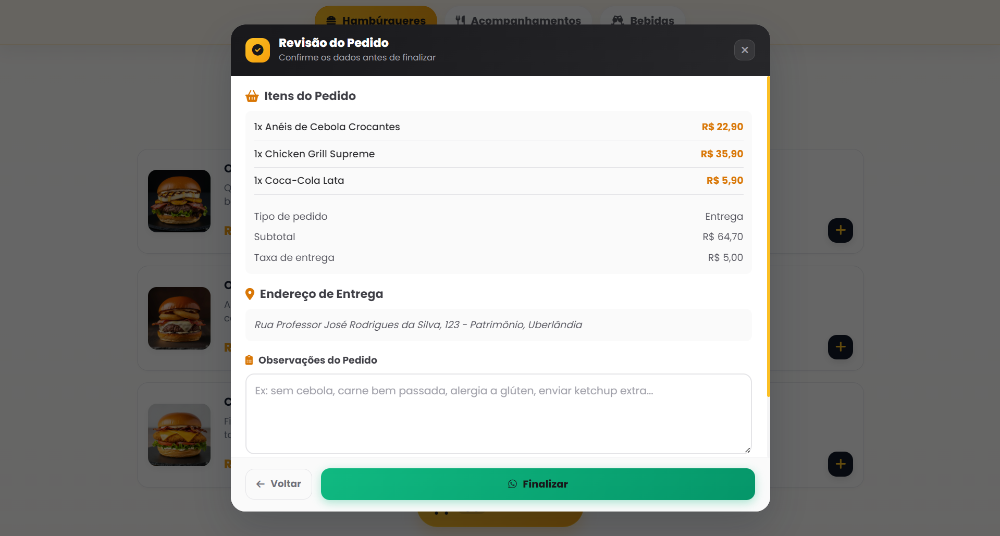

# 🍔 The Burger House

Aplicação **full-stack de pedidos para hamburgueria**, desenvolvida com **HTML5, JavaScript Vanilla, Tailwind CSS, Vite, ASP.NET Core 9 e Entity Framework Core**, com cardápio digital, carrinho, entrega ou retirada, criação de pedidos no backend, checkout hospedado do PagBank, webhooks, reconciliação de pagamentos, integração com WhatsApp, testes automatizados e CI/CD.

🌐 [Deploy](https://burger-shop-aiib.vercel.app/) • 📂 [Repositório](https://github.com/felipe-frc/the-burger-house) • 🧪 [GitHub Actions](https://github.com/felipe-frc/the-burger-house/actions) • 📦 [Releases](https://github.com/felipe-frc/the-burger-house/releases)

[](https://github.com/felipe-frc/the-burger-house/actions)
[](https://burger-shop-aiib.vercel.app/)


---

## 📌 Sobre o projeto

O **The Burger House** simula uma experiência real de compra em uma hamburgueria, desde a escolha dos produtos até a confirmação final do pedido.

O cliente pode navegar pelo cardápio, adicionar produtos ao carrinho, escolher entre **entrega ou retirada**, consultar endereço por CEP, revisar o pedido, criar o pedido no backend, realizar o pagamento em checkout hospedado do PagBank e, após a aprovação, confirmar o atendimento pelo WhatsApp.

O projeto começou como uma aplicação front-end e evoluiu para uma arquitetura full-stack. Atualmente, o frontend em JavaScript se comunica com uma API ASP.NET Core responsável por regras de pedidos, persistência, pagamentos e sincronização com o PagBank.

O fluxo de pagamentos utiliza o **checkout hospedado do PagBank**. O backend cria e mantém a identidade do pagamento localmente, recebe eventos por webhook e realiza reconciliação direta da cobrança antes de atualizar o estado do pedido. Consulte [configuração, checkout, webhook e reconciliação](docs/pagbank.md).

### 🎯 O que este projeto demonstra

| Competência | Aplicação no projeto |
| --- | --- |
| JavaScript | ES Modules, DOM, eventos, estado, serviços e regras de interface |
| C# / .NET | ASP.NET Core 9, API REST, DI, handlers, serviços e validações |
| Arquitetura | Separação em Domain, Application, Infrastructure e API |
| Persistência | Entity Framework Core + SQLite e migrations |
| Integração | ViaCEP, PagBank, WhatsApp e comunicação frontend/backend |
| Pagamentos | Checkout hospedado, webhooks, idempotência e reconciliação |
| Segurança | Validação de URLs, assinatura de webhook, secrets externos e auditoria |
| Testes | Vitest, xUnit, Playwright, jsdom e axe-core |
| Qualidade | ESLint, Prettier, TypeScript `checkJs`, builds e quality gates |
| Acessibilidade | Navegação por teclado, ARIA, foco e auditoria automatizada |
| Performance | Otimização de mídia e auditoria com Lighthouse |
| CI/CD | GitHub Actions, Vercel e Azure App Service |
| Deploy | Frontend na Vercel e backend no Azure |

---

## ⭐ Destaques técnicos

- **92/92 testes front-end** com Vitest
- **233/233 testes backend** em projetos .NET
- **22/22 execuções E2E** com Playwright: desktop + mobile
- Backend em **ASP.NET Core 9** organizado em camadas
- Persistência com **Entity Framework Core + SQLite**
- Criação de pedidos e pagamentos via API REST
- Integração com **PagBank Hosted Checkout**
- Processamento de **webhooks financeiros**
- Reconciliação direta por `CHAR_...` antes de alterações críticas
- Proteções de **idempotência** e consistência de estado
- Separação entre identificadores `CHEC_...`, `ORDE_...` e `CHAR_...`
- Checkout público limitado a hosts HTTPS esperados
- Frontend e backend publicados separadamente em **Vercel + Azure App Service**
- Integração ViaCEP isolada em `scripts/services/viacep-service.js`
- Regras do carrinho isoladas em `cart-service.js`
- Estado compartilhado centralizado em `state.js`
- Internacionalização em **Português e Inglês**
- Auditorias de acessibilidade com **axe-core**
- Cobertura protegida por **quality gates**
- Lighthouse Mobile: **95 Performance / 100 Accessibility / 100 Best Practices / 100 SEO**
- **0 vulnerabilidades** no `npm audit`
- Auditoria de segurança integrada ao CI

---

## 🚀 Funcionalidades

| Área | Recursos |
| --- | --- |
| 🍔 Cardápio | Produtos por categoria, imagens, descrições, preços, tags e tradução |
| 🛒 Carrinho | Adição, remoção, quantidade, subtotal, taxa, total e persistência |
| 🚚 Entrega / Retirada | Fluxos independentes com tratamento da taxa de entrega |
| 📍 Endereço | Consulta ViaCEP, preenchimento automático e validações |
| 📦 Pedidos | Criação e persistência pelo backend |
| 💳 Pagamentos | Checkout hospedado do PagBank |
| 🔔 Webhooks | Sincronização financeira do pagamento |
| 🔄 Reconciliação | Consulta direta da cobrança e atualização segura do estado |
| ✅ Retorno | Consulta do pagamento após retorno do checkout |
| 💬 WhatsApp | Confirmação final com mensagem estruturada |
| 🌎 Idiomas | Português/Inglês com persistência da preferência |
| 🕒 Loja | Status Aberto/Fechado calculado dinamicamente |

### 🍔 Cardápio

- Exibição por categorias: Hambúrgueres, Acompanhamentos e Bebidas
- Renderização dinâmica via JavaScript
- Dados centralizados em módulo próprio
- Imagens, descrições, preços e tags
- Navegação rápida por categorias
- Animações de entrada durante o scroll
- Tradução dinâmica dos produtos
- Catálogo correspondente ao backend

### 🛒 Carrinho

- Adicionar e remover produtos
- Incrementar e decrementar quantidade
- Remoção automática ao chegar a zero
- Cálculo de subtotal, taxa de entrega e total
- Persistência com `localStorage`
- Validação de carrinho vazio
- Feedback visual com toast
- Regras principais isoladas em `cart-service.js`

### 🚚 Entrega ou retirada

**Entrega**

- mantém a taxa de entrega
- direciona para o formulário de endereço
- exige dados válidos antes da revisão
- envia o pedido com modalidade de entrega ao backend

**Retirada no local**

- dispensa o preenchimento do endereço
- remove automaticamente a taxa de entrega
- segue diretamente para a revisão
- envia o pedido com modalidade de retirada ao backend

### 📍 Endereço de entrega

- Consulta automática por CEP
- Integração com a API ViaCEP
- Preenchimento automático de rua, bairro e cidade
- Validação do CEP e número do endereço
- Tratamento de CEP inexistente
- Tratamento de falhas de rede
- Mensagens de erro acessíveis
- Indicação visual dos campos preenchidos automaticamente

### 📦 Revisão e finalização

A revisão apresenta:

- produtos selecionados
- quantidade de cada item
- subtotal
- taxa de entrega
- total final
- tipo de pedido
- endereço, quando aplicável
- campo opcional de observações

Na finalização:

1. o frontend cria o pedido pela API
2. o backend valida produtos, valores e regras
3. um pagamento local é criado ou reutilizado
4. o backend solicita um checkout hospedado ao PagBank
5. o navegador é redirecionado para o checkout
6. após o pagamento, o PagBank envia o evento financeiro ao webhook
7. o backend valida, reconcilia e persiste o novo estado
8. o cliente retorna ao site
9. o frontend consulta o status do pagamento
10. com o pagamento aprovado, o WhatsApp é aberto com a mensagem final do pedido

### 🌎 Internacionalização

- Português e Inglês
- Seletor de idioma
- Persistência da preferência no `localStorage`
- Tradução dos principais textos
- Tradução do cardápio dinâmico
- Atualização imediata da interface ao trocar o idioma
- Cobertura automatizada da camada de i18n

---

## ♿ Acessibilidade

A acessibilidade faz parte da implementação e da estratégia de testes.

| Recurso | Aplicação |
| --- | --- |
| `aria-live` | Comunicação de atualizações dinâmicas |
| `aria-modal` | Identificação dos modais |
| `aria-describedby` | Associação entre campos e mensagens |
| `role="alert"` | Mensagens importantes e erros |
| Focus trap | Mantém a navegação dentro do modal |
| Teclado | Navegação e fechamento com `Esc` |
| Gerenciamento de foco | Foco automático e restauração ao fechar |
| Overlay | Fechamento controlado dos modais |
| Alt text | Descrição das imagens |
| Contraste | Revisão dos elementos críticos |

### 🧪 Auditorias automatizadas

O projeto utiliza **axe-core integrado ao Playwright** para auditar automaticamente:

- página inicial
- carrinho
- formulário de endereço
- revisão do pedido

As verificações consideram regras relacionadas a:

- WCAG 2.0 A
- WCAG 2.0 AA
- WCAG 2.1 A
- WCAG 2.1 AA

---

## 🛠️ Tecnologias

| Categoria | Tecnologia |
| --- | --- |
| Frontend | HTML5 + JavaScript ES6+ |
| Estilização | Tailwind CSS + CSS customizado |
| Build / Dev Server | Vite |
| Backend | ASP.NET Core 9 |
| Linguagem backend | C# |
| ORM | Entity Framework Core |
| Banco de dados | SQLite |
| API | REST |
| Gateway de pagamento | PagBank Hosted Checkout |
| Webhooks | PagBank |
| API externa | ViaCEP |
| Finalização | WhatsApp |
| Persistência local | `localStorage` |
| Testes frontend | Vitest + jsdom |
| Testes backend | xUnit / .NET test |
| E2E | Playwright |
| Acessibilidade automatizada | axe-core |
| Cobertura frontend | Vitest Coverage V8 |
| Lint | ESLint |
| Formatação | Prettier |
| Typecheck | TypeScript `checkJs` |
| CI/CD | GitHub Actions |
| Deploy frontend | Vercel |
| Deploy backend | Azure App Service |
| Versionamento | Git / GitHub |

---

## 🏗️ Arquitetura

A estrutura separa responsabilidades entre interface, aplicação, domínio, infraestrutura e integrações externas.

### Frontend

| Módulo | Responsabilidade |
| --- | --- |
| `scripts/data.js` | Produtos e dados do cardápio |
| `scripts/cart-service.js` | Regras de negócio do carrinho |
| `scripts/cart.js` | Interface e eventos do carrinho |
| `scripts/state.js` | Estado compartilhado e persistência |
| `scripts/address.js` | Formulário e regras de endereço |
| `scripts/services/viacep-service.js` | Comunicação com ViaCEP |
| `scripts/api.js` | Comunicação com o backend |
| `scripts/order.js` | Revisão, checkout, retorno e WhatsApp |
| `scripts/i18n.js` | Internacionalização |
| `scripts/ui.js` | Interface, modais e navegação |
| `scripts/config.js` | Configurações gerais |
| `scripts/main.js` | Inicialização da aplicação |
| `scripts/utils.js` | Funções utilitárias |

### Backend

```txt
BurgerHouse.Api
        ↓
BurgerHouse.Application
        ↓
BurgerHouse.Domain
        ↑
BurgerHouse.Infrastructure
```

| Projeto | Responsabilidade |
| --- | --- |
| `BurgerHouse.Api` | Controllers, endpoints, configuração e webhooks |
| `BurgerHouse.Application` | Casos de uso, handlers e abstrações |
| `BurgerHouse.Domain` | Entidades, enums, regras e transições de estado |
| `BurgerHouse.Infrastructure` | EF Core, repositórios, PagBank e persistência |
| `*.Tests` | Testes automatizados por camada |

### Fluxo principal

```txt
Cliente
  ↓
Frontend (Vercel)
  ↓
ASP.NET Core API (Azure)
  ↓
Application / Domain
  ↓
EF Core + SQLite
  ↓
PagBank Hosted Checkout
  ↓
Webhook financeiro
  ↓
Validação + reconciliação
  ↓
Payment / Order atualizados
  ↓
Retorno ao frontend
  ↓
WhatsApp
```

### 📁 Estrutura do repositório

```txt
the-burger-house/
│
├── .github/
│   └── workflows/
│       ├── frontend-ci.yml
│       └── feat-backend-foundation_the-burger-house-api.yml
│
├── assets/
│   ├── optimized/
│   │   └── logo-burger.webp
│   └── ...
│
├── backend/
│   ├── BurgerHouse.Api/
│   ├── BurgerHouse.Application/
│   ├── BurgerHouse.Domain/
│   ├── BurgerHouse.Infrastructure/
│   ├── BurgerHouse.Api.Tests/
│   ├── BurgerHouse.Application.Tests/
│   ├── BurgerHouse.Domain.Tests/
│   ├── BurgerHouse.Infrastructure.Tests/
│   └── BurgerHouse.sln
│
├── docs/
│   ├── images/
│   │   ├── home.png
│   │   ├── cardapio.png
│   │   ├── cart.png
│   │   ├── pedido.png
│   │   ├── endereco.png
│   │   └── revisao.png
│   └── pagbank.md
│
├── public/
│   └── robots.txt
│
├── scripts/
│   ├── services/
│   │   └── viacep-service.js
│   ├── address.js
│   ├── api.js
│   ├── cart-service.js
│   ├── cart.js
│   ├── config.js
│   ├── data.js
│   ├── i18n.js
│   ├── main.js
│   ├── order.js
│   ├── state.js
│   ├── ui.js
│   └── utils.js
│
├── styles/
│   └── style.css
│
├── tests/
│   ├── e2e/
│   └── ...
│
├── Dockerfile
├── package.json
├── package-lock.json
├── playwright.config.js
├── README.md
├── tailwind.config.js
└── vercel.json
```

---

## 📸 Interface

### 🏠 Página inicial

Hero section, identidade visual da hamburgueria, informações de atendimento e status dinâmico da loja.



### 🍔 Cardápio

Produtos organizados por categorias, com imagem, descrição, preço, destaque e ação para adicionar ao carrinho.



### 🛒 Carrinho

Edição do pedido com quantidade, subtotal, taxa e total.



### 🚚 Tipo de pedido

Escolha entre **Entrega** ou **Retirada no local**.



### 📍 Endereço de entrega

Consulta automática do CEP, preenchimento assistido e validações.



### 📦 Revisão do pedido

Resumo final dos produtos, valores, modalidade, endereço e observações.



---

## ✅ Qualidade e testes

### 📊 Estado atual

| Métrica | Resultado |
| --- | ---: |
| Testes front-end (Vitest) | **92/92** |
| Testes backend (.NET) | **233/233** |
| Testes com falha | **0** |
| E2E Playwright | **22/22** |
| Vulnerabilidades npm | **0** |

### 📈 Cobertura e quality gates

O frontend mantém quality gates automatizados no pipeline.

| Métrica | Cobertura de referência | Quality Gate |
| --- | ---: | ---: |
| Statements | **75.63%** | 75% |
| Branches | **58.81%** | 55% |
| Functions | **85.62%** | 80% |
| Lines | **78.89%** | 75% |

> Os valores de cobertura acima correspondem à última medição documentada. Se a cobertura cair abaixo dos limites configurados, o CI falha automaticamente.

### 🧪 Vitest

A suíte cobre, entre outros módulos:

- `address.js`
- `viacep-service.js`
- `cart-service.js`
- `cart.js`
- `data.js`
- `i18n.js`
- `main.js`
- `order.js`
- `ui.js`
- `utils.js`

Entre os cenários validados estão:

- consistência dos dados do cardápio
- formatação de preços
- escape de HTML
- regras do carrinho
- quantidade de produtos
- subtotal, taxa e total
- estado da interface
- inicialização da aplicação
- internacionalização
- endereço e ViaCEP
- revisão do pedido
- integração com API
- retorno do checkout
- construção da mensagem do WhatsApp
- preservação de Unicode na mensagem final

### 🧪 Backend .NET

Os testes estão distribuídos por camada:

- domínio e transições de estado
- criação de pedidos
- criação e consulta de pagamentos
- idempotência
- persistência e migrations
- checkout PagBank
- mapeamento de status
- validação de assinatura de webhook
- processamento de eventos financeiros
- reconciliação por cobrança
- cenários de erro e respostas inválidas

### 🎭 Playwright

A suíte E2E valida os fluxos principais em desktop e mobile, incluindo:

- compra completa com entrega
- retirada no local sem endereço
- CEP inválido
- bloqueio quando o carrinho fica vazio
- troca de idioma
- observações longas
- remoção de produto antes da revisão
- acessibilidade da página inicial, carrinho, endereço e revisão
- integração do fluxo de checkout sem expor dados sensíveis
- confirmação final pelo WhatsApp

---

## ⚡ Performance, SEO e segurança

O projeto foi auditado com **Google Lighthouse** em Chrome Incognito utilizando perfil Mobile.

### 📊 Lighthouse

| Categoria | Pontuação |
| --- | ---: |
| Performance | **95** |
| Accessibility | **100** |
| Best Practices | **100** |
| SEO | **100** |

### ⚙️ Métricas

| Métrica | Resultado |
| --- | ---: |
| First Contentful Paint | **1.7 s** |
| Largest Contentful Paint | **2.7 s** |
| Total Blocking Time | **10 ms** |
| Cumulative Layout Shift | **0.008** |
| Speed Index | **1.9 s** |

### 🖼️ Otimização de mídia

A logo principal passou de aproximadamente **1.56 MB para ~8 KB**.

```txt
Performance: 74 → 95
LCP:         10.6 s → 2.7 s
```

A versão otimizada também é utilizada no **Open Graph**.

### 🔎 SEO

- `meta description`
- Open Graph com asset otimizado
- `robots.txt` válido
- imagens com dimensões definidas
- textos alternativos
- estrutura semântica
- mídia principal otimizada

### 🔐 Segurança

Frontend:

```bash
npm audit
```

Estado atual:

```txt
found 0 vulnerabilities
```

Além da auditoria de dependências, o projeto possui proteções específicas no fluxo de pagamento:

- tokens e secrets não são versionados
- URLs públicas de checkout são validadas
- somente HTTPS é aceito no redirecionamento
- hosts de checkout permitidos são restritos
- o navegador não recebe credenciais do PagBank
- webhooks são validados antes do processamento
- operações financeiras são correlacionadas com IDs persistidos
- eventos repetidos são tratados de forma idempotente
- reconciliação inválida não sobrescreve o último estado local conhecido

---

## 🔁 CI/CD

O projeto possui pipelines separados para frontend e backend.

### Frontend

O GitHub Actions executa:

```txt
Quality
   ↓
Build
   ↓
E2E
```

### 🧪 Quality

```bash
npm ci
npm audit
npm run lint
npm run format:check
npm run typecheck
npm run test:coverage
```

Valida segurança, qualidade do JavaScript, formatação, tipos e cobertura.

### 🏗️ Build

```bash
npm ci
npm run build
```

Só é executado após o job **Quality** terminar com sucesso.

### 🎭 E2E

O workflow:

1. instala as dependências
2. instala o Chromium
3. gera o build de produção
4. sobe o servidor local do Vite
5. aguarda o servidor responder
6. executa os E2E
7. valida desktop e mobile

### Backend

O backend possui pipeline de build e deploy para o **Azure App Service**:

```txt
Checkout
   ↓
.NET 9 setup
   ↓
Restore
   ↓
Build
   ↓
Publish
   ↓
Artifact
   ↓
Deploy Azure App Service
```

---

## ⚙️ Como executar

### Pré-requisitos

- Node.js 20 ou superior
- npm
- .NET SDK 9
- Git

### Instalação

Clone o repositório:

```bash
git clone https://github.com/felipe-frc/the-burger-house.git
cd the-burger-house
```

#### Frontend

```bash
npm ci
npm run dev
```

O frontend local será disponibilizado em uma URL semelhante a:

```txt
http://localhost:5173
```

#### Backend

```bash
cd backend
dotnet restore BurgerHouse.sln
dotnet build BurgerHouse.sln
dotnet run --project BurgerHouse.Api
```

O banco SQLite local utiliza a connection string configurada em `appsettings`.

### PagBank

Credenciais reais não devem ser colocadas no repositório.

As configurações são fornecidas por variáveis de ambiente / configuração externa:

```txt
PagBank__BaseUrl
PagBank__Token
PagBank__RedirectUrl
PagBank__NotificationUrl
```

Consulte [`docs/pagbank.md`](docs/pagbank.md) para detalhes do checkout, webhook e reconciliação.

### Comandos disponíveis

| Objetivo | Comando |
| --- | --- |
| Instalar dependências frontend | `npm ci` |
| Iniciar frontend | `npm run dev` |
| Gerar build frontend | `npm run build` |
| Visualizar build frontend | `npm run preview` |
| Executar lint | `npm run lint` |
| Verificar formatação | `npm run format:check` |
| Executar typecheck | `npm run typecheck` |
| Rodar testes frontend | `npm test` |
| Rodar testes com cobertura | `npm run test:coverage` |
| Rodar E2E | `npm run e2e` |
| Auditar dependências | `npm audit` |
| Restaurar backend | `dotnet restore backend/BurgerHouse.sln` |
| Compilar backend | `dotnet build backend/BurgerHouse.sln` |
| Testar backend | `dotnet test backend/BurgerHouse.sln` |
| Executar API | `dotnet run --project backend/BurgerHouse.Api` |

O build frontend é gerado em:

```txt
dist/
```

---

## 🧠 Decisões de desenvolvimento

| Decisão | Motivo |
| --- | --- |
| JavaScript Vanilla | Aprofundar fundamentos da linguagem, DOM, eventos e módulos |
| Vite | Modernizar o ambiente de desenvolvimento e build |
| ES Modules | Separar responsabilidades e reduzir arquivos monolíticos |
| `cart-service.js` | Isolar regras do carrinho da interface |
| `state.js` | Centralizar estado e persistência |
| Service ViaCEP | Separar comunicação HTTP da lógica do formulário |
| ASP.NET Core 9 | Criar um backend tipado, testável e adequado a APIs REST |
| Arquitetura em camadas | Separar domínio, casos de uso, infraestrutura e entrada HTTP |
| EF Core + SQLite | Adicionar persistência estruturada com migrations |
| Abstrações de pagamento | Evitar acoplamento direto das regras de negócio ao provedor |
| Migração para PagBank | Evoluir a integração mantendo o domínio desacoplado do gateway |
| Hosted Checkout | Manter dados sensíveis de pagamento fora da aplicação |
| Webhook + reconciliação | Sincronizar o estado financeiro com validações adicionais |
| Idempotência | Evitar efeitos duplicados em reenvios e novas tentativas |
| i18n | Concentrar textos e permitir troca dinâmica de idioma |
| axe-core + Playwright | Automatizar verificações de acessibilidade |
| Testes em camadas | Proteger domínio, aplicação, infraestrutura, DOM e fluxos completos |
| Quality gates | Impedir queda de cobertura abaixo dos limites |
| ESLint + Prettier + Typecheck | Melhorar consistência e detecção antecipada de problemas |
| GitHub Actions | Automatizar qualidade, build, testes e deploy |
| Vercel + Azure | Separar deploy do frontend e da API |

A camada de pagamentos foi projetada por abstrações. Isso permitiu a evolução do provedor de pagamento sem transportar regras específicas para o domínio da aplicação.

---

## 🧾 Releases

| Versão | Categoria | Destaque |
| --- | --- | --- |
| **Em desenvolvimento** | 🚧 Full-stack | Backend ASP.NET Core, persistência, pedidos, PagBank, webhooks, reconciliação e Azure |
| **v2.7.0** | 🚀 Última publicada | Hardening técnico, testes, E2E desktop/mobile, acessibilidade, Lighthouse, SEO e segurança |
| [v2.6.0](https://github.com/felipe-frc/the-burger-house/releases/tag/v2.6.0) | 🧪 Testes | Testes E2E com Playwright |
| [v2.5.0](https://github.com/felipe-frc/the-burger-house/releases/tag/v2.5.0) | ♻️ Refatoração | Refatoração do carrinho e cobertura de testes |
| [v2.4.1](https://github.com/felipe-frc/the-burger-house/releases/tag/v2.4.1) | 🛠️ Manutenção | Documentação, CI e otimização da logo |
| [v2.4.0](https://github.com/felipe-frc/the-burger-house/releases/tag/v2.4.0) | 🌎 Feature | Internacionalização inicial |
| [v2.3.0](https://github.com/felipe-frc/the-burger-house/releases/tag/v2.3.0) | 🧪 Testes | Testes automatizados com Vitest |
| v2.2.2 | 🩹 Correção | Correções de consistência estrutural |
| v2.2.1 | ⚡ Melhoria | Melhorias de SEO e performance |
| v2.2.0 | ✨ Feature | Retirada no local e melhorias no carrinho |
| v2.1.0 | ✨ Feature | Campo de observações no pedido |
| v2.0.0 | 🚀 Major | Melhorias de navegação e UX |
| v1.3.0 | ♿ Melhoria | Acessibilidade e experiência nos modais |
| v1.2.1 | 🩹 Correção | Correções de CI e produção |
| v1.2.0 | 🩹 Correção | Correções no formulário de endereço |
| v1.1.0 | ♻️ Refatoração | Refatoração estrutural |
| v1.0.0 | 🎉 Inicial | Primeira versão estável |

📦 [Consultar histórico completo de releases](https://github.com/felipe-frc/the-burger-house/releases)

---

## 🔮 Melhorias futuras

- 🔎 Busca de produtos
- 🧩 Filtros no cardápio
- 📝 Observações específicas por item
- 🚚 Cálculo de entrega por região ou faixa de CEP
- 🔐 Autenticação
- 🧑‍💼 Painel administrativo
- 🧾 Histórico de pedidos
- 📦 Acompanhamento do status do pedido
- 🛍️ Gerenciamento de produtos pelo painel
- 💾 Evolução do banco de produção para PostgreSQL
- 📊 Observabilidade e health checks
- 🚦 Rate limiting
- 💸 Fluxos administrativos de cancelamento e reembolso

---

## ⚠️ Observações

- A consulta de endereço depende da disponibilidade da API ViaCEP
- É necessário acesso à internet para consulta real de CEP
- O checkout de pagamento é hospedado pelo PagBank
- A aplicação não armazena dados de cartão
- Tokens e credenciais do gateway não devem ser versionados
- O webhook é o mecanismo principal de sincronização financeira
- A consulta de status pode reconciliar pagamentos que já possuam `ExternalPaymentId`
- O carrinho é persistido no `localStorage`
- A preferência de idioma também é persistida no navegador
- A confirmação final pelo WhatsApp ocorre após a aprovação do pagamento
- `coverage/` é gerado localmente e não deve ser versionado
- Relatórios do Playwright são temporários
- `output.css` é gerado pelo processo de desenvolvimento/build
- A fonte principal dos estilos permanece em `styles/style.css`
- No Azure, o banco SQLite persistente utiliza o diretório `/home`
- Configurações específicas de Sandbox não devem ser tratadas como configuração de produção real

---

## 📄 Licença

Este projeto está sob a licença **MIT**. Consulte o arquivo [LICENSE](LICENSE).

---

## 👨🏻‍💻 Autor

**Marcos Felipe França**

[LinkedIn](https://www.linkedin.com/in/marcosfelipefrc) • [GitHub](https://github.com/felipe-frc)
